# 🚀 Bank Management System (React + .NET 9 API)

A complete full‑stack **Banking Management System** built using a modern tech stack — **React (Frontend)** and **.NET 9 Web API (Backend)** with JWT authentication, refresh tokens, dashboards, admin modules, and full banking operations.

---

## 🌟 Features

### 🎨 Frontend (React)

* Fully responsive modern UI
* JWT + Refresh Token Authentication
* Role‑based dashboards (Admin, Manager, Employee, Customer)
* User Management (CRUD)
* Account operations

  * Deposit
  * Withdraw
  * Transfer
  * Close Account
* Transaction History
* Admin Controls

  * Bank Management
  * Branch Management
  * User Roles
* Reusable shared components

  * Navbar
  * Sidebar
  * DataTable
  * Modals

### ⚙️ Backend (.NET 9 Web API)

* Secure JWT Auth + Refresh Token
* Entity Framework Core 9 + SQL Server
* Clean Controllers & DTOs
* Role & Permission Management
* Banking Modules:

  * Accounts
  * Transactions
  * Banks
  * Branches
  * Users
* Migration-based DB setup
* Production-ready architecture

---

## 📂 Project Folder Structure

### 🖥 Frontend (React)

```
/src
  App.js
  components/
    Home.jsx
    LoginParent.jsx
    UserManagement.jsx
    accounts/
    admin/
    shared/
    transactions/
  redux/
    userSlice.js
    accountsSlice.js
    transactionsSlice.js
  utils/
    api.js
    toast.js
```

### ⚙️ Backend (ASP.NET Core Web API)

```
/BankCustomerAPI
  Controllers/
  Data/
  Entities/
  Models/
  Services/
  Migrations/
  Program.cs
  appsettings.json
```

---

## 🛠 Installation & Setup

### ▶️ Backend Setup (.NET 9)

```bash
cd BankCustomerAPI
# Restore dependencies
dotnet restore

# Apply migrations
dotnet ef database update

# Run server
dotnet run
```

Backend runs at: **[https://localhost:7092](https://localhost:7092)**

---

### ▶️ Frontend Setup (React)

```bash
cd frontend/Project/project
npm install
npm start
```

Frontend runs at: **[http://localhost:3000](http://localhost:3000)**

---

## 📡 API Endpoints Summary

### 🔐 Authentication

* POST `/api/auth/login`
* POST `/api/auth/refresh`

### 👥 Users

* GET `/api/user`
* POST `/api/user`

### 🏦 Accounts

* POST `/api/accounts/create`
* POST `/api/accounts/deposit`
* POST `/api/accounts/withdraw`
* POST `/api/accounts/transfer`

### 💳 Transactions

* GET `/api/transactions/{userId}`

### 🏛 Bank & Branch

* GET `/api/banks`
* POST `/api/banks`
* GET `/api/branches`
* POST `/api/branches`

---

## 🎬 GIF Demo

Show a quick walk-through of your application using a demo GIF.

> Add your demo GIF as: `screenshots/demo.gif`


---

## 🖼 Screenshots

A modern, clean **screenshot gallery** displayed in a 3‑column grid layout using Markdown tables.

### 📸 Gallery

|                                                                                   |                                                                                        |                                                                                          |
| --------------------------------------------------------------------------------- | -------------------------------------------------------------------------------------- | ---------------------------------------------------------------------------------------- |
| 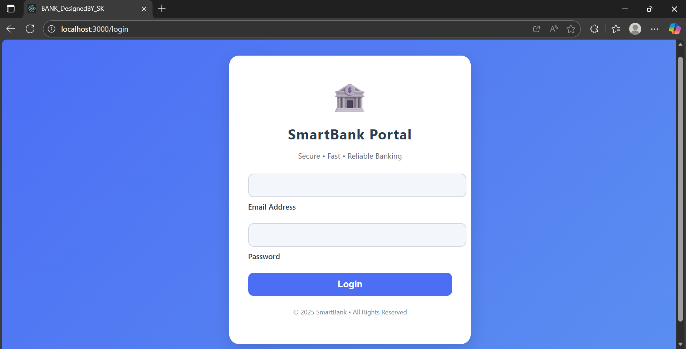 <br> **Login Page**                          | 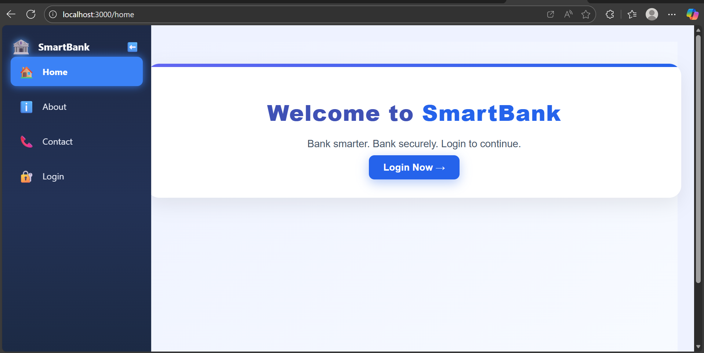 <br> **Guest Homepage**                       | 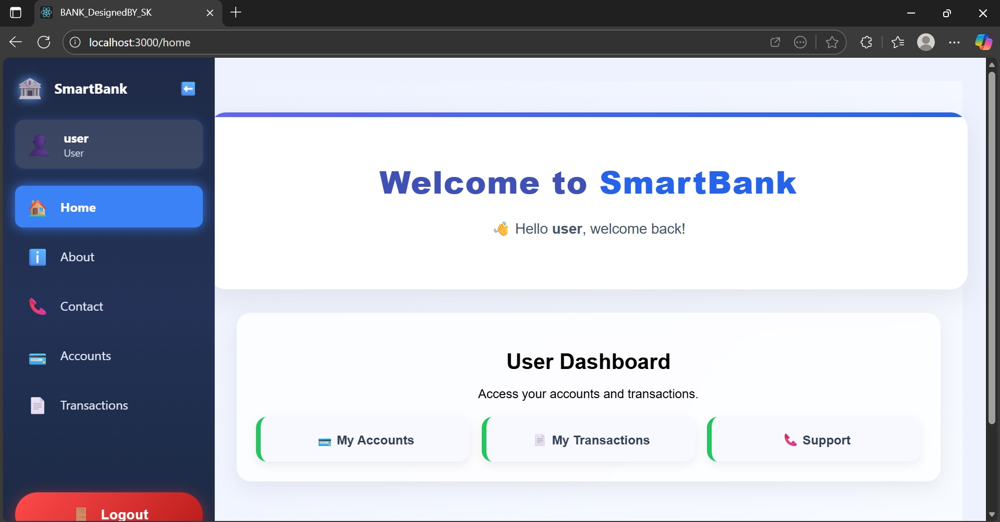 <br> **User Homepage**                       |
| 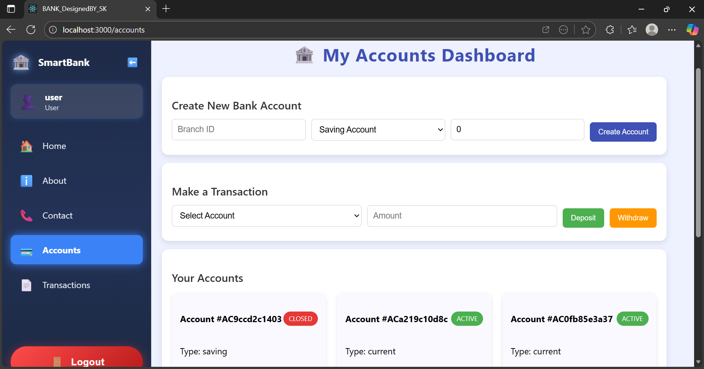 <br> **User Dashboard** | 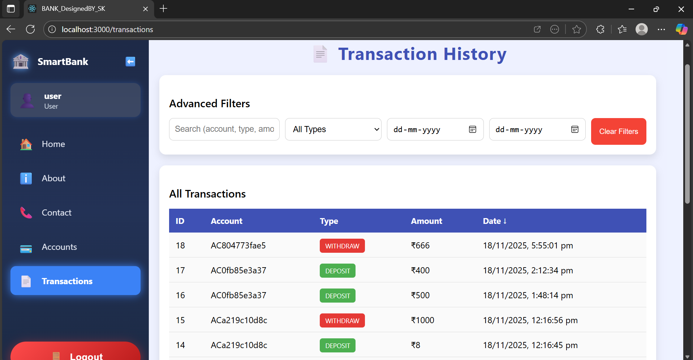 <br> **Transaction History** | 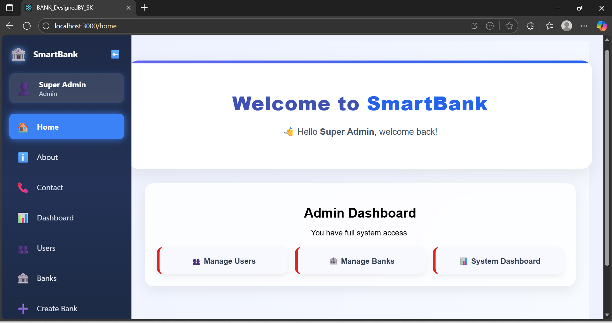 <br> **Admin Homepage**                    |
| 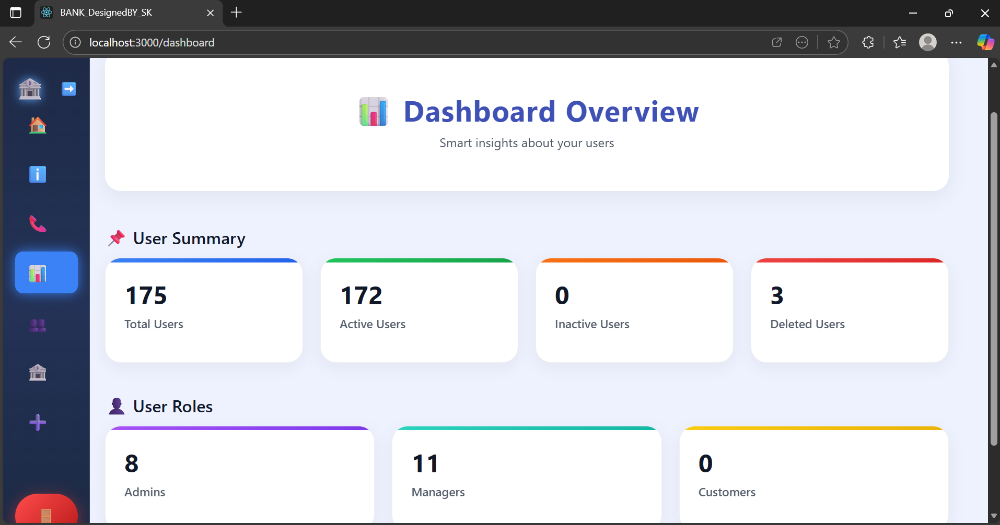 <br> **Admin Dashboard**      | 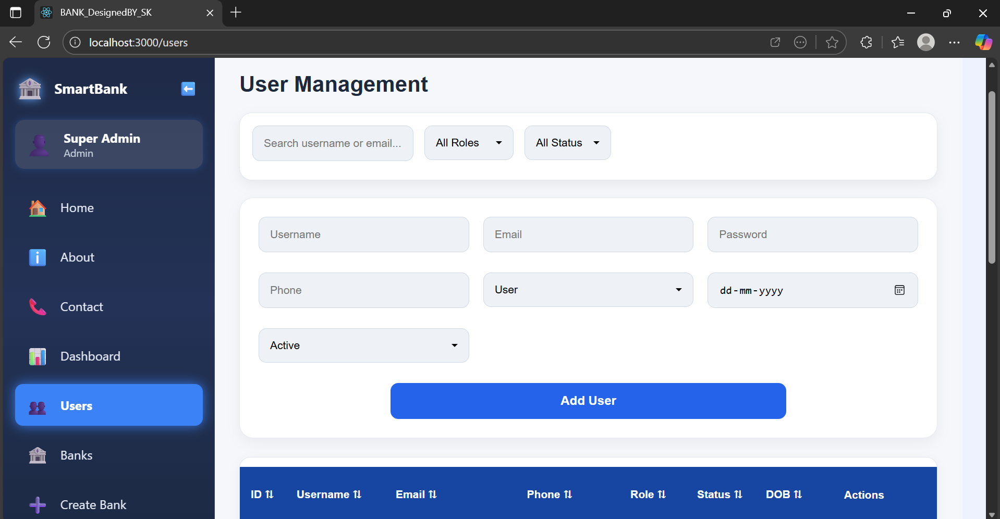 <br> **User Management**         |  <br> **Bank & Branch Management** |
| 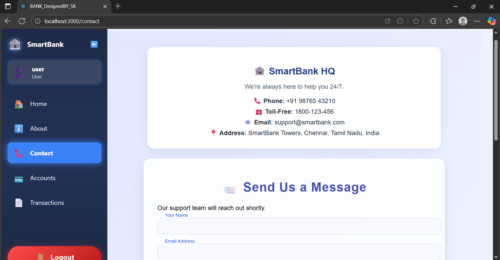 <br> **Contact Page**                    | 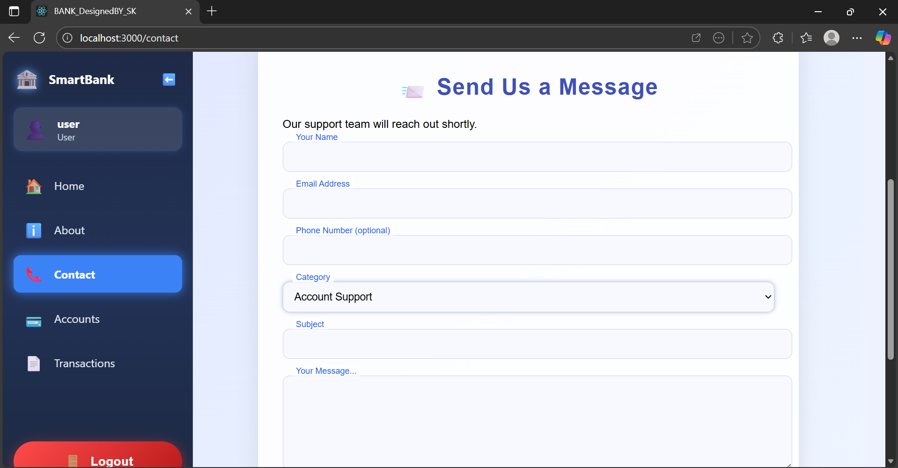 <br> **Support Page**                      | 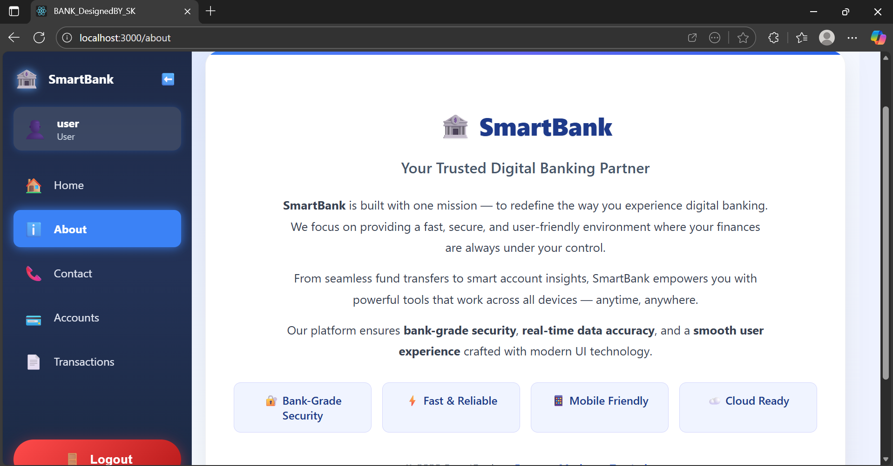 <br> **About Page**                                 |

---

## 🧪 Running Tests

React Testing Library:

```bash
npm test
```

---

## 👨‍💻 Tech Stack

### Frontend

* React 18
* Redux Toolkit
* Axios
* CSS Modules

### Backend

* .NET 9 Web API
* Entity Framework Core 9
* SQL Server
* JWT + Refresh Token

---
